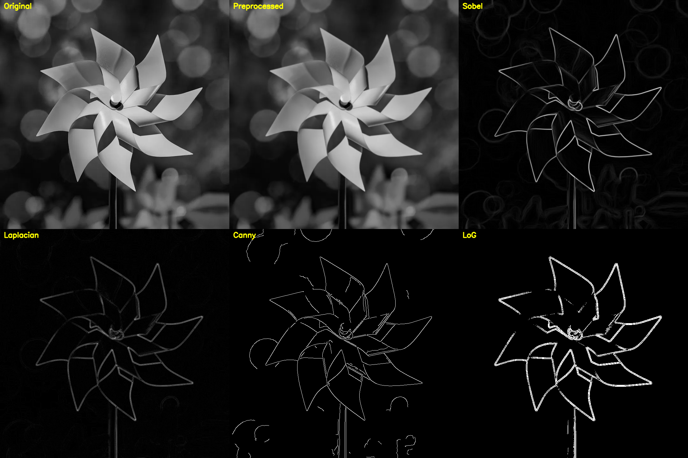
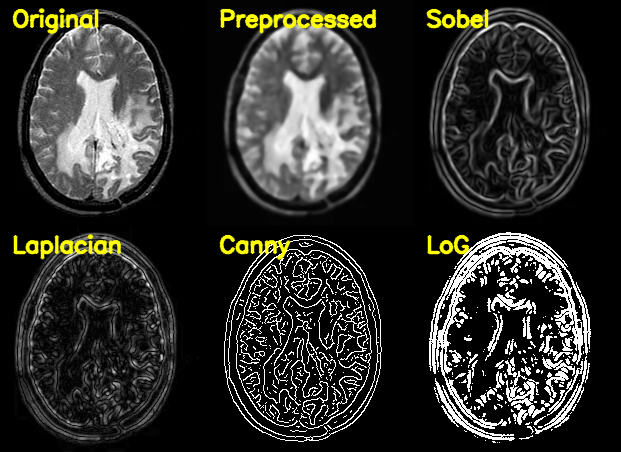

# G1-MIP-BonusQuestion

使用至少三種邊緣偵測方法，對 [ToBeDetect](./ToBeDetect) 中兩張影像進行偵測：
- 一般影像：[windmill.webp](./ToBeDetect/windmill.webp)
- 醫學影像：[brain.webp](./ToBeDetect/brain.webp)

本專案實作方法：
- Sobel
- Laplacian
- Canny
- LoG (Laplacian of Gaussian)

## 快速導覽

- [執行方式](#執行方式)
- [輸出結果](#輸出結果)
- [方法比較報告](#方法比較報告)

## 專案結構

```text
.
├─ ToBeDetect/
│  ├─ windmill.webp
│  └─ brain.webp
├─ requirement.txt
├─ edge_detection.py
├─ EdgeResults/
│  ├─ windmill/
│  └─ brain/
└─ EDGE_METHODS_REPORT.md
```

## 環境需求

- Python 3.11
- 依賴檔案：[requirement.txt](./requirement.txt)

## 執行方式

### 1. 安裝套件

```powershell
pip install -r requirement.txt
```

### 2. 執行邊緣偵測

```powershell
python edge_detection.py
```

## 輸出結果

執行後輸出到：
- [EdgeResults/windmill](./EdgeResults/windmill)
- [EdgeResults/brain](./EdgeResults/brain)

整合比較圖：
- [windmill comparison_panel.png](./EdgeResults/windmill/comparison_panel.png)
- [brain comparison_panel.png](./EdgeResults/brain/comparison_panel.png)

預覽：

### Windmill (General Image)



### Brain (Medical Image)



每張影像另外輸出：
- `00_original_gray.png`
- `01_preprocessed.png`
- `02_sobel.png`
- `03_laplacian.png`
- `04_canny.png`
- `05_log.png`

## 方法比較報告

詳細說明請看：
- [EDGE_METHODS_REPORT.md](./EDGE_METHODS_REPORT.md)
